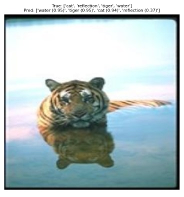
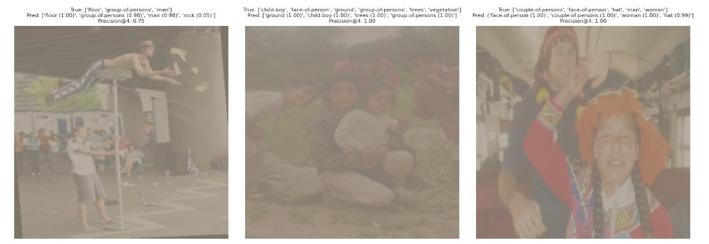

# ReSwin Net: Hybrid CNN–Transformer for Multi-Label Image Annotation

ReSwin Net is a hybrid deep learning framework that combines ResNet-50 for fine-grained feature extraction with the Swin Transformer for capturing long-range dependencies. It uses a token projection module to fuse CNN and Transformer features and a label pruning strategy to handle rare or noisy labels. ReSwin Net achieves improved stability and annotation accuracy on Corel5K and IAPRTC benchmarks, outperforming existing methods.

## How to use
### Requirements
* Environment that supports python notebook. Kaggle Notebook has been used for running this particular project.
* The default GPU P-100 is used for this project

## Dataset Description
The standard Corel5k Dataset and iaprtc12 Dataset are being used for this project. The link is given below:

[iaprtc12](https://www-i6.informatik.rwth-aachen.de/imageclef/resources/saiaprtc12/)

You may refer to this paper for more details regarding the above dataset. [The IAPR Benchmark: A New Evaluation Resource for Visual Information Systems](http://thomas.deselaers.de/publications/papers/grubinger_lrec06.pdf) ***The images from iaprtc12 has been moved to a single folder***

[Corel5K Dataset](https://drive.google.com/file/d/1HDnX6yjbVC7voUJ93bCjac2RHn-Qx-5p/view?usp=sharing) ***The images from Corel5k dataset has been moved to a single folder.***

## Sample Output

